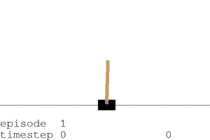
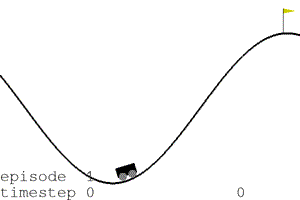
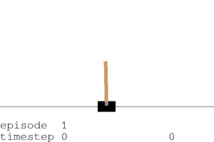
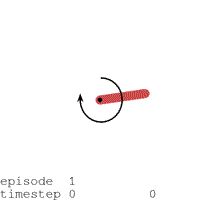
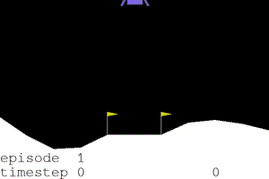

# Reinforcement Learning Beginnings

## Basics with genetic algorithms

I've been interested in reinforcement learning, but I've found it too intimidating. Instead I've started with genetic algorithms. I'm happy to have solved [cart-pole](https://gym.openai.com/envs/CartPole-v1/) and [mountain-car](https://gym.openai.com/envs/MountainCar-v0/) with them. While genetic algorithms technically aren't reinforcement learning, I still find them pretty cool to play with.

There's a reinforcement book by Sutton and Barto you may find helpful. They describe what reinforcement learning is about.

Some vocabulary I've learned:
* Agent: the algorithm playing the game
* Environment: what we'd call the game, what the agent interacts with
* Episode: a game round/match
* Reward: the positive or negative feedback the agent receives from the environment
* Action: an action taken by the agent
* State/observation: information from the environment to agent, which the agents responds to
* Policy: the agent's strategy for using action `a` when confronted with state `s`
* Value: how the agent values actions; genetic algorithms don't use value functions unlike true reinforcement learning models

## Environments

* CartPole [https://gym.openai.com/envs/CartPole-v1/](https://gym.openai.com/envs/CartPole-v1/)
* MountainCar [https://gym.openai.com/envs/MountainCar-v0/](https://gym.openai.com/envs/MountainCar-v0/)
* Pendulum [https://github.com/openai/gym/wiki/Pendulum-v0](https://github.com/openai/gym/wiki/Pendulum-v0)
* LunarLander [https://github.com/openai/gym/wiki/Leaderboard#lunarlander-v2](https://github.com/openai/gym/wiki/Leaderboard#lunarlander-v2)
* BipedalWalker [https://github.com/openai/gym/wiki/BipedalWalker-v2](https://github.com/openai/gym/wiki/BipedalWalker-v2)

## Jupyter Notebooks

The agents I use are all linear models. Cart-pole uses a logistic regression. Multi-output environments use a softmax regression. For extra control the observations can be transformed into polynomials.

### 1 Random Agents

I try out some basic OpenAI Gym code. If you haven't heard of it before, OpenAI Gym is a friendly way to get RL environments (little games) to play with. With a bit of code you can get it to display its games as GIFs, which is the main point of this notebook.

### 2 Modelled Agents

This can be skipped. I tried to solve the games with my own ideas. I failed.

### 3 Genetic Agents

I finally try a genetic algorithm and have success. I try different configurations to see the effect.

### 4 MountainCar

I try the genetic algorithm on the Mountain-Car environment, which is alledgedly difficult for some RL models to solve. After some early failures, I got the genetic algorithm to work well with it.

### 5 Modifying Rewards for cart-pole

I've noticed some of the cart pole agents drift off screen but still win the game. If I add a light penalty for straying off-center will they behave better? Yes.

### 6 Pendulum

This game has you trying to balance a pendulum upside down. The GA does alright.

### 7 Lunar Lander

In this game you try to land a spacecraft on a lunar base. The GA does alright (140) but doesn't solve the game (200).

### 8 Bipedal Bot

Teach a robot to walk. The GA makes it skips for a few yards.

## An ioslides Presentation

I've made a presentation [here](http://htmlpreview.github.io/?https://github.com/sjchiass/ml_guides/blob/master/Reinforcement%20Learning/Beginnings/Presentation.html#1).

## Further plans

I either want to include more environments, or try my hand at a genuine RL model.